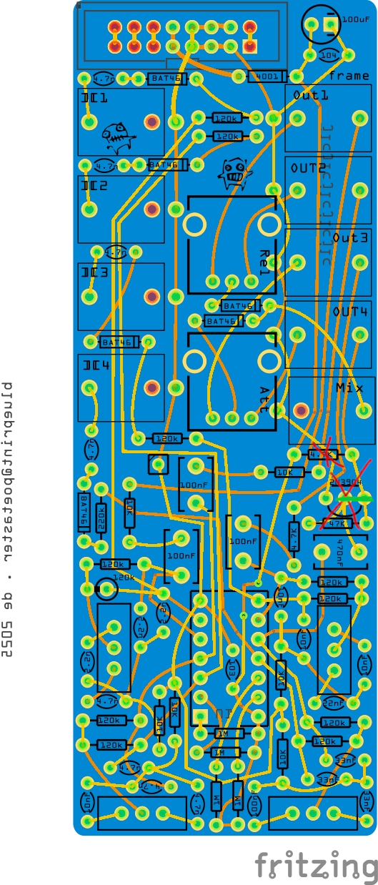
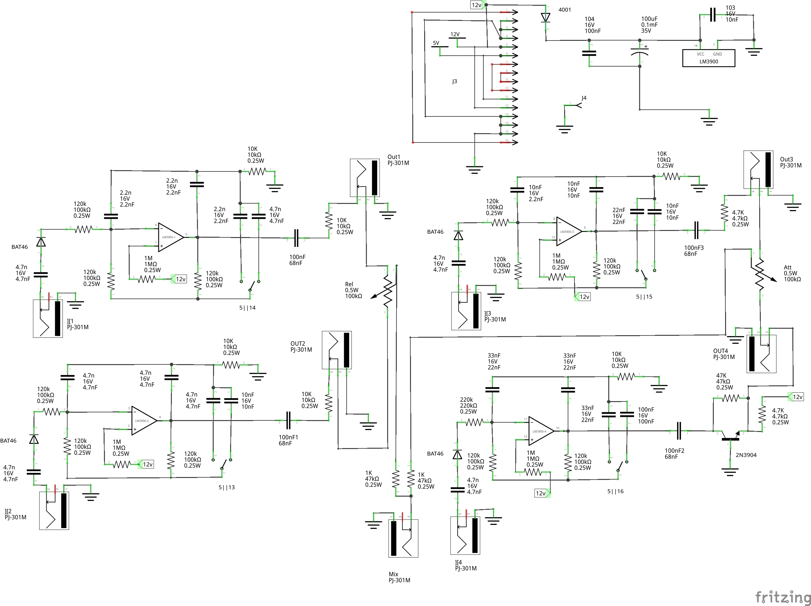
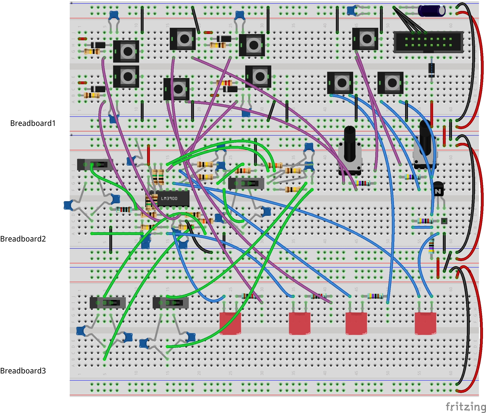

# frame
An analog drum machine like thing. It's based on Gamelan Resonators as introduced by Paul Demarinis. See https://pauldemarinis.org/Circuits.html , The Pygmy Gamelan.

You can see it in action at https://poetaster.org/eurorack/frame/ with audio and video....

I initially became aware of this version of the circuit through NLC https://www.nonlinearcircuits.com/modules/p/tinkle?itemId=tinkle I use some aspects of NLC's (resistance values) but don't use op amps and adjust the imput impedence a bit. 

