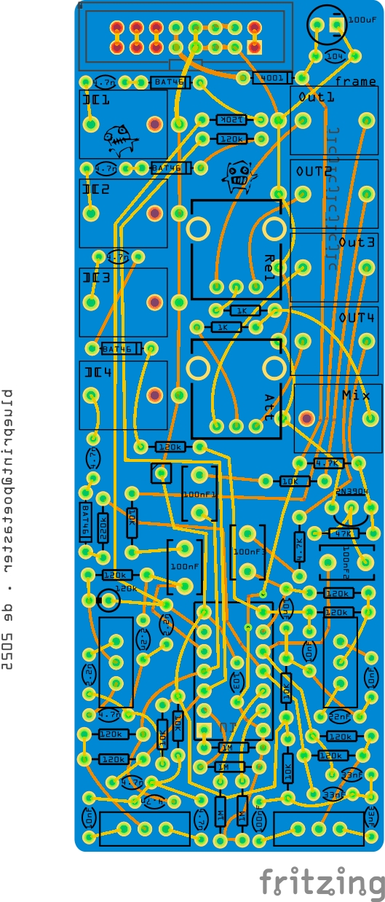

# frame
An analog drum machine like thing. It's based on Gamelan Resonators as introduced by Paul Demarinis. See https://pauldemarinis.org/Circuits.html , The Pygmy Gamelan.

I initially became aware of this circuit through NLC https://www.nonlinearcircuits.com/modules/p/tinkle?itemId=tinkle

